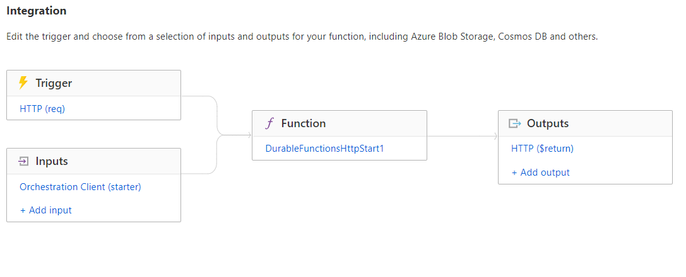

# AzureDurableFuntionHTTPTriggerSample
Sample repository to show how an Azure Function App using Durable function with a basic HTTP trigger can be initiated. This HTTP trigger then routes to an Orchestrator which calls Activity tasks such as Approve and Escalate

## Illustrations
An HTTP trigger that has a binding expression to the Orchestration Client which is referred in the Function App `DurableFunctionHttpStart1`. This function is then routing to two different Durable function activities approve or escalate depending on the request type of the client.  

